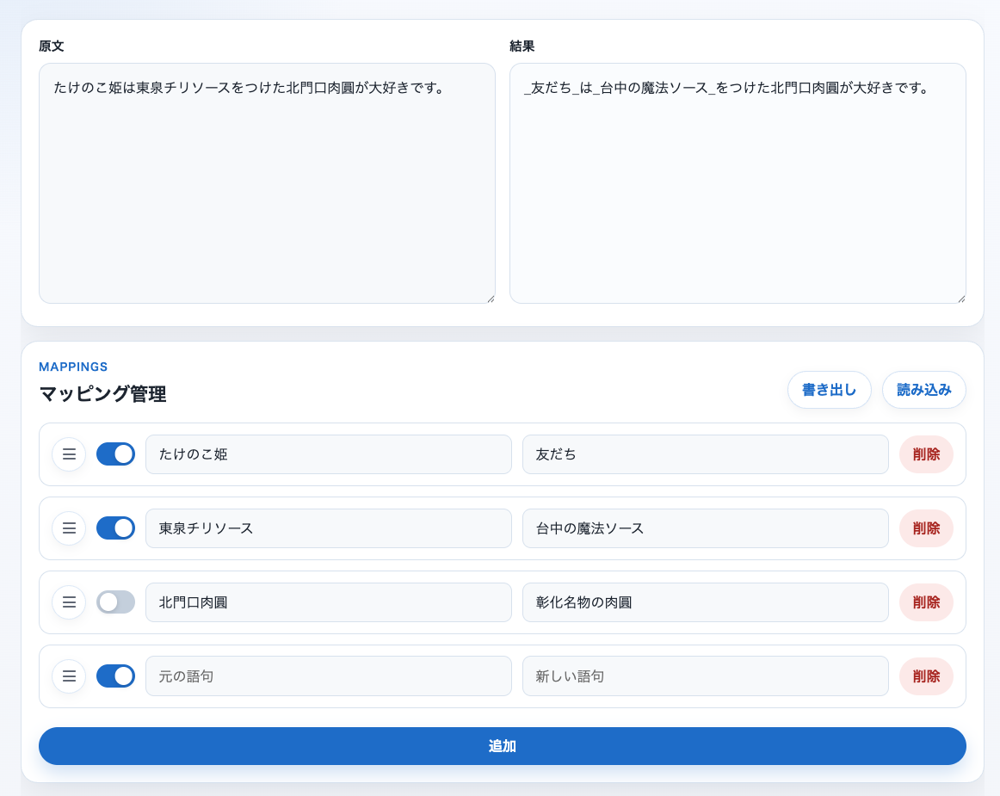

# PrePrompt

[English](./README.md) | [繁體中文](./README.zh-TW.md) | [日本語](./README.ja.md)

LLM に文章を貼り付ける前に、PrePrompt で機密情報を置き換えます。

PrePrompt はブラウザで動く小さなツールです。単なる文字置換ではなく、再利用できるマッピングを管理し、人名やプロジェクト名などの機密語句を LLM に送る前に差し替えることに重点を置いています。

データはすべてブラウザ内に保存され、サーバーには送信されません。

## 使い方

[GitHub Pages](https://clhuang224.github.io/pre-prompt/) のページを開けばそのまま使えます。

ローカルで試す場合は、このフォルダを簡単な静的サーバーで配信して `index.html` を開いてください。

## スクリーンショット



## 機能

- 再利用できる語句マッピングを編集
- 各ルールを switch で有効 / 無効化
- ドラッグハンドルで順序を並べ替え
- JSON でマッピングを読み込み / 書き出し
- 結果欄をクリックしてそのままコピー
- 繁體中文、英語、日本語の UI 切り替え

> 置換後の語句は見分けやすいように `_` で囲まれます。

## プロジェクト構成

```text
.
├── index.html
├── demo.png
├── README.md
├── README.zh-TW.md
├── README.ja.md
└── assets
    ├── favicon.png
    ├── css
    │   ├── base.css        # 共通トークンとグローバルスタイル
    │   ├── layout.css      # レイアウト
    │   └── components.css  # コンポーネントスタイル
    └── js
        ├── app.js          # フロントエンドの入口
        ├── constants.js    # 共通定数
        ├── i18n.js         # 言語切り替えとロケール処理
        ├── storage.js      # LocalStorage の読み書き
        ├── mappings.js     # マッピング一覧の描画
        ├── import-export.js# JSON の読み込み / 書き出し
        ├── output.js       # 置換結果とコピー処理
        ├── sortable.js     # SortableJS 連携
        ├── toast.js        # トースト通知
        └── locales
            ├── en.js
            ├── ja.js
            └── zh-TW.js
```

## 保存

原文とマッピングは、現在のブラウザの LocalStorage に保存されます。

読み込み / 書き出しには JSON を使うので、バックアップや別端末への移行が簡単です。

## 現在の制限

- 現在は単純な文字列置換のみ
- 正規表現、大文字小文字判定、単語境界の扱いは未対応
- データは現在のブラウザにのみ保存

## 今後の予定

- 正規表現対応
- 大文字小文字と単語境界の改善
- 読み込み / 書き出し形式の追加
- 機密情報の自動検出

## もとになったもの

PrePrompt は次のシンプルな shell script の試作版から発展しました。

[replace_words.sh](https://gist.github.com/clhuang224/aaf38d8f3caec8aaf44d4dfa5c5ede15)

## License

MIT
