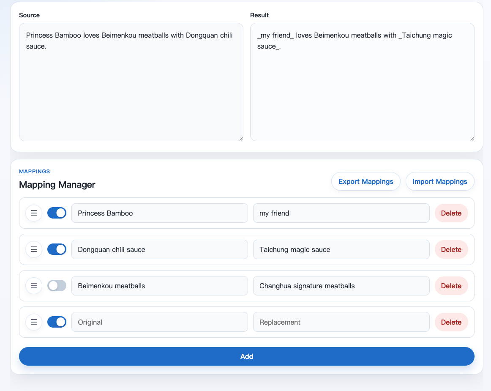

# PrePrompt

[English](./README.md) | [繁體中文](./docs/README.zh-TW.md) | [日本語](./docs/README.ja.md)

Replace sensitive details before sending text to an LLM.

PrePrompt is a small browser-based tool focused on reusable mapping management, so you can swap names, project terms, or other sensitive words before pasting text into an LLM.

All data stays in your browser. Nothing is sent to a server.

## How To Use

Open the [GitHub Pages](https://clhuang224.github.io/pre-prompt/) site to use it directly.

If you want to test locally, serve this folder with any simple static server and open `index.html`.

## Screenshot



## Features

- Edit reusable mappings for original and replacement terms
- Enable or disable each rule with a switch
- Reorder mappings by dragging the handle
- Import and export mappings as JSON
- Click the output area to copy the current result
- Switch the UI between Traditional Chinese, English, and Japanese

> Replacement terms are wrapped with `_` on both sides to make them easier to spot.

## Project Structure

```text
.
├── index.html
├── README.md
├── docs
│   ├── README.zh-TW.md
│   ├── README.ja.md
│   ├── demo.png
│   ├── demo.zh-TW.png
│   └── demo.ja.png
└── assets
    ├── favicon.png
    ├── css
    │   ├── base.css        # Shared tokens and global styles
    │   ├── layout.css      # Page layout
    │   └── components.css  # Component styles
    └── js
        ├── app.js          # App entry point and wiring
        ├── constants.js    # Shared constants
        ├── i18n.js         # Locale selection and language helpers
        ├── storage.js      # LocalStorage helpers
        ├── mappings.js     # Mapping list rendering
        ├── import-export.js# JSON import/export
        ├── output.js       # Replacement output and copy behavior
        ├── sortable.js     # SortableJS integration
        ├── toast.js        # Toast status messages
        └── locales
            ├── en.js
            ├── ja.js
            └── zh-TW.js
```

## Storage

Source text and mappings are stored in LocalStorage in the current browser only.

Import and export use JSON so you can back up or move your mappings between devices.

## Current Limits

- String replacement only for now
- No regex, case handling, or word-boundary logic yet
- Data is stored only in the current browser

## Roadmap

- Support regular expressions
- Improve case and word-boundary handling
- Add more import/export formats
- Detect sensitive information automatically

## Origin

PrePrompt started from this small shell script prototype:

[replace_words.sh](https://gist.github.com/clhuang224/aaf38d8f3caec8aaf44d4dfa5c5ede15)

## License

MIT
