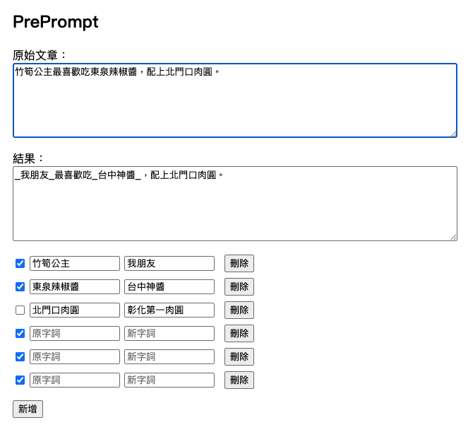

# PrePrompt

[English](./README.md) | [繁體中文](./README.zh-TW.md) | [日本語](./README.ja.md)

將文字貼進 LLM 前，用 PrePrompt 替換敏感資訊。

PrePrompt 是一個在瀏覽器中執行的小工具，重點不只是文字取代，而是維護一套可重用的詞組對照表，方便在把文章貼給 LLM 前，先替換掉人名、專案代號或其他敏感資訊。

所有資料都只存在瀏覽器本機，不會送到伺服器。

## 如何使用

直接開啟 GitHub Pages 頁面即可使用。

如果想在本機測試，建議用任何簡單的靜態伺服器開這個資料夾，再打開 `index.html`。

## 專案畫面



## 功能

- 編輯可重用的詞組對照表
- 用 switch 啟用或停用每條規則
- 用拖曳把手調整詞組順序
- 以 JSON 匯入 / 匯出詞組
- 點擊結果區可直接複製內容
- 支援繁體中文、英文、日文介面切換

> 新字詞會統一加上 `_` 前後綴，以避免與原字詞混淆。

## 專案結構

```text
.
├── index.html
├── demo.png
├── README.md
├── README.zh-TW.md
├── README.ja.md
└── assets
    ├── favicon.png
    ├── css
    │   ├── base.css        # 基本變數與全域樣式
    │   ├── layout.css      # 版面配置
    │   └── components.css  # 元件樣式
    └── js
        ├── app.js          # 前端入口與事件綁定
        ├── constants.js    # 共用常數
        ├── i18n.js         # 語系選擇與語言工具
        ├── storage.js      # LocalStorage 讀寫
        ├── mappings.js     # 詞組列表渲染
        ├── import-export.js# JSON 匯入 / 匯出
        ├── output.js       # 替換結果與點擊複製
        ├── sortable.js     # SortableJS 拖曳排序整合
        ├── toast.js        # Toast 狀態訊息
        └── locales
            ├── en.js
            ├── ja.js
            └── zh-TW.js
```

## 資料儲存

原始文章和詞組會儲存在目前瀏覽器的 LocalStorage 中。

匯入 / 匯出使用 JSON 格式，方便備份或在不同裝置之間搬移常用詞組。

## 目前限制

- 目前是單純字串取代
- 尚未支援正則表達式、大小寫判斷與斷詞邊界處理
- 資料只儲存在目前瀏覽器

## 未來方向

- 支援正則表達式
- 改善大小寫與斷詞判斷
- 支援更多匯入 / 匯出格式
- 自動偵測敏感資訊

## 前身

PrePrompt 最初是從這個簡單的 shell script 原型發展而來：

[replace_words.sh](https://gist.github.com/clhuang224/aaf38d8f3caec8aaf44d4dfa5c5ede15)

## License

MIT
